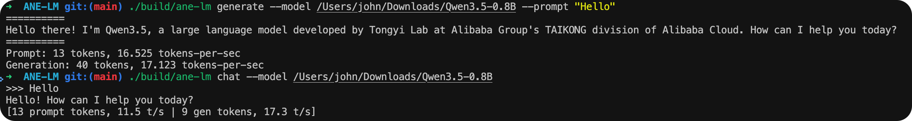

# ANE-LM Batch Bench

**ANE Batch Prefill for On-Device Parallel LLM Inference**

Enabling concurrent ANE prefill and GPU decode on Apple Silicon via batched ANE dispatch with the private `AppleNeuralEngine.framework`.

[Paper PDF](https://atomgradient.github.io/hybird-batch-prefill-on-ane/paper.pdf) · [Project Page](https://atomgradient.github.io/hybird-batch-prefill-on-ane/) · Companion to [hybrid-ane-mlx-bench](https://github.com/AtomGradient/hybrid-ane-mlx-bench)

## Key Results

| Metric | Value |
|--------|-------|
| Batch prefill speedup (vs sequential dispatch) | **11.3×** (0.8B), **7.3×** (2B) |
| ANE batch prefill throughput | **268 tok/s** (0.8B), **173 tok/s** (2B) |
| ANE beats GPU on short prompts (0.8B, 13 tok) | 149 vs 138 tok/s |
| GPU power during ANE prefill | **0.22 W** (282× reduction vs GPU prefill) |
| State transfer overhead | **<30 ms** |
| TTFT from turn 2+ (hybrid concurrent) | **27 ms** (3.7× faster than GPU-only) |

## Benchmark Results

All values averaged over 10 runs. M2 Ultra, 192 GB. Temperature = 0, max 20 decode tokens.

### Qwen3.5-0.8B FP16

| Prompt | Mode | Prefill tok/s | Decode tok/s | Total ms |
|--------|------|:---:|:---:|:---:|
| Short (13 tok) | ANE | **148.7** | 17.6 | 2,931 |
| | MLX | 138.2 | 61.2 | 3,679 |
| | Hybrid | 148.3 | 39.4 | 6,050 |
| Medium (28 tok) | ANE | 237.5 | 16.4 | 3,645 |
| | MLX | 290.0 | 64.5 | 3,836 |
| | Hybrid | 237.9 | 53.9 | 6,280 |
| Long (74 tok) | ANE | 268.0 | 17.1 | 3,774 |
| | MLX | **736.2** | 64.1 | 3,846 |
| | Hybrid | 271.1 | 54.0 | 6,335 |

### Qwen3.5-2B BF16

| Prompt | Mode | Prefill tok/s | Decode tok/s | Total ms |
|--------|------|:---:|:---:|:---:|
| Short (13 tok) | ANE | 91.7 | 12.4 | 5,271 |
| | MLX | 179.6 | **90.8** | 4,076 |
| | Hybrid | 92.8 | 22.6 | 8,878 |
| Medium (28 tok) | ANE | 160.4 | 12.5 | 6,189 |
| | MLX | 358.0 | **94.1** | 4,212 |
| | Hybrid | 159.3 | 29.0 | 9,281 |
| Long (74 tok) | ANE | 172.7 | 12.7 | 6,455 |
| | MLX | **828.6** | **92.4** | 4,274 |
| | Hybrid | 173.1 | 29.2 | 9,518 |

### Batch vs Sequential Dispatch (74 tokens)

| Model | Dispatch Mode | Prefill tok/s | Speedup |
|-------|--------------|:---:|:---:|
| 0.8B | Sequential (1 tok/dispatch) | 23.7 | 1.0× |
| | **Batch (32 tok/dispatch)** | **268.0** | **11.3×** |
| | GPU baseline (MLX) | 736.2 | 31.1× |
| 2B | Sequential (1 tok/dispatch) | 23.7 | 1.0× |
| | **Batch (32 tok/dispatch)** | **172.7** | **7.3×** |
| | GPU baseline (MLX) | 828.6 | 35.0× |

### Power Consumption

| Phase | GPU (W) | ANE (W) | CPU (W) | Total |
|-------|:---:|:---:|:---:|:---:|
| GPU prefill | 62.05 | 0.00 | 2.34 | 64.39 W |
| GPU decode | 14.17 | 0.00 | 2.98 | 17.15 W |
| ANE prefill | **0.22** | 1.58 | 3.77 | **5.57 W** |
| ANE decode | 0.16 | 1.42 | 5.47 | 7.05 W |

> During concurrent ANE prefill + GPU decode, total power is ~15.8 W vs 76 W if both phases used GPU. **79% power reduction** for the prefill component.

## Architecture

Three inference pipelines are benchmarked:

1. **Pure ANE** — ANE batch prefill (32 tok/dispatch) + ANE sequential decode → ~12–18 tok/s
2. **Pure MLX (GPU)** — GPU prefill + GPU decode via MLX framework → ~61–94 tok/s
3. **Hybrid (this work)** — ANE batch prefill → state serialization (<30 ms) → MLX GPU decode → ~23–54 tok/s

The hybrid pipeline's value is **concurrent execution**: since ANE prefill uses only 0.22 W GPU power, the GPU can simultaneously decode a previous request at full speed.

### Seamless Conversation Pipeline

In multi-turn conversations, ANE prefills the user's new input *while* the GPU decodes the previous response. TTFT for turn 2+ drops to just **27 ms** (state transfer only).

## Supported Models

| Model | Architecture | Precision |
|-------|-------------|-----------|
| Qwen3.5-0.8B | Hybrid (DeltaNet + FullAttn) | FP16 |
| Qwen3.5-2B | Hybrid (DeltaNet + FullAttn) | BF16 |
| Qwen3-0.6B | Dense Attention | FP16 |

## Build

```bash
cmake -B build -DCMAKE_BUILD_TYPE=Release
cmake --build build
```

Requirements: macOS 13.0+, Apple Silicon (M1/M2/M3/M4/M5), C++17.

## Usage



```bash
# Single-shot generation
./build/ane-lm generate --model /path/to/Qwen3.5-0.8B --prompt "Hello"

# Interactive chat
./build/ane-lm chat --model /path/to/Qwen3.5-0.8B

# Pre-convert weights (BF16 -> FP16, speeds up subsequent loads)
./build/ane-lm convert --model /path/to/Qwen3.5-0.8B
```

### Options

```
--model <path>       Path to model directory (required)
--prompt <text>      Input prompt (generate mode, default: "Hello")
--max-tokens N       Max tokens to generate (default: unlimited)
--temp T             Temperature (default: 0.6)
--repeat-penalty P   Repetition penalty (default: 1.2, 1.0=off)
--enable-thinking    Enable thinking/reasoning mode
--no-ane-cache       Disable persistent ANE compile cache
-v, --verbose        Show detailed initialization info
```

### Hybrid Pipeline

```bash
# Run ANE prefill, save state, then decode with MLX on GPU
pip install -r scripts/requirements.txt
python scripts/hybrid_decode.py --state /tmp/ane_state.bin --model /path/to/model
```

## Test Hardware

| Spec | Value |
|------|-------|
| Machine | Mac Studio (2023) |
| Chip | Apple M2 Ultra |
| CPU | 24 cores (16P + 8E) |
| GPU | 76 cores |
| ANE | 32 cores (31.6 TOPS) |
| Memory | 192 GB unified |
| Bandwidth | 800 GB/s |
| OS | macOS 26 (Tahoe) |

## Citation

```bibtex
@misc{atomgradient2026batchprefill,
  title  = {ANE Batch Prefill for On-Device Parallel LLM Inference},
  author = {AtomGradient},
  year   = {2026},
  url    = {https://github.com/AtomGradient/hybird-batch-prefill-on-ane}
}
```

## Acknowledgments

- [maderix/ANE](https://github.com/maderix/ANE) — Reverse-engineering Apple Neural Engine private APIs. Without this foundational work, this research would not have been possible.
- [johnmai-dev/ANE-LM](https://github.com/johnmai-dev/ANE-LM) — LLM inference on Apple Neural Engine. Pioneering work that enabled our batch prefill implementation.
- [llama.cpp](https://github.com/ggml-org/llama.cpp) — LLM inference in C/C++
